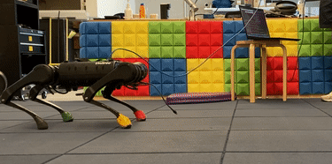

## **HKD-MPC**
The HKD-MPC is a nonlinear MPC controller for agile and versatile quadruped locomotion. It enables highly dynamic jumping and rapid gait transition in one framework, without the need to switch between multiple controllers. The HKD-MPC has been tested on Unitree A1 and MIT Mini Cheetah. This repo contains the 
implementation for the MIT Mini Cheetah. 

## **Demo**
   

## **Dependency**
This implementation only requires two external dependencies, Eigen and LCM. A customized Hybrid-Systems DDP solver is employed to solve the nonlinear trajectory optimization problem, which is part of this repo, and can be found [here](https://github.com/heli-sudoo/HKD-MPC/tree/ICRA22%2BIROS23/MPC_Controller/HSDDPSolver).
- [Eigen3](https://gitlab.com/libeigen/eigen)
- [LCM1.4.0](https://github.com/lcm-proj/lcm/releases)


## **Build**
Once Eigen and LCM are successfully installed, generate necessary lcm types

```bash
cd scripts
./make_types.sh
```

Then build the controller

```bash
cd ../MPC_Controller
mkdir build && cd build
cmake ..
make -j4
```

## **Run in Cheetah Software**
Instructions coming soon