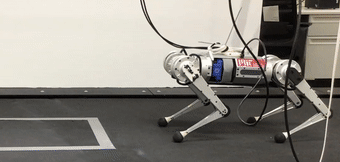

## **HKD-MPC**
The HKD-MPC is a nonlinear MPC controller for agile and versatile quadruped locomotion. It enables highly dynamic jumping and rapid gait transition in one framework, without the need to switch between multiple controllers. The HKD-MPC has been tested on Unitree A1 and MIT Mini Cheetah. This repo contains the 
implementation for the MIT Mini Cheetah. 

## **Demo**
   

## **Dependency**
This implementation uses [Eigen](https://gitlab.com/libeigen/eigen) for linear algegra, [LCM](https://github.com/lcm-proj/lcm/releases) for communications to low-level controllers, and [boost](https://www.boost.org/users/history/) for reading configuration files. A customized **Hybrid-Systems DDP (HS-DDP)** solver is employed to solve the nonlinear trajectory optimization problem. A C++ implementation of **HS-DDP** is included in this repo and can be found [here](https://github.com/heli-sudoo/HKD-MPC/tree/ICRA22%2BIROS23/MPC_Controller/HSDDPSolver).

- [Eigen3](https://gitlab.com/libeigen/eigen)
- [LCM1.4.0](https://github.com/lcm-proj/lcm/releases)
- [Boost1.71](https://www.boost.org/users/history/)


## **Build**
Once Eigen and LCM are successfully installed, generate necessary lcm types

```bash
cd scripts
./make_types.sh
```

To build the HKDMPC controller

```bash
mkdir build && cd build
cmake ..
make -j4
```

To run the HKDMPC controller
```bash
cd build
HKDMPC/hkdmpc_run
```

## **Run in Cheetah Software**
Instructions coming soon

## **Selected Publications**
[1] Li, H., & Wensing, P. M. (2020). Hybrid systems differential dynamic programming for whole-body motion planning of legged robots. IEEE Robotics and Automation Letters, 5(4), 5448-5455.

[2] Li, H., Zhang, T., Yu, W., & Wensing, P. M. (2022). Versatile Real-Time Motion Synthesis via Kino-Dynamic MPC with Hybrid-Systems DDP. arXiv preprint arXiv:2209.14138.

